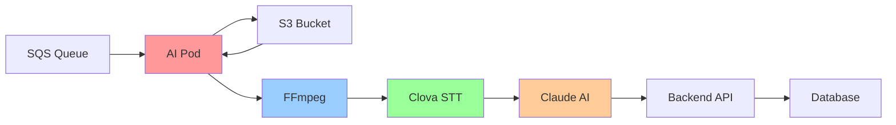
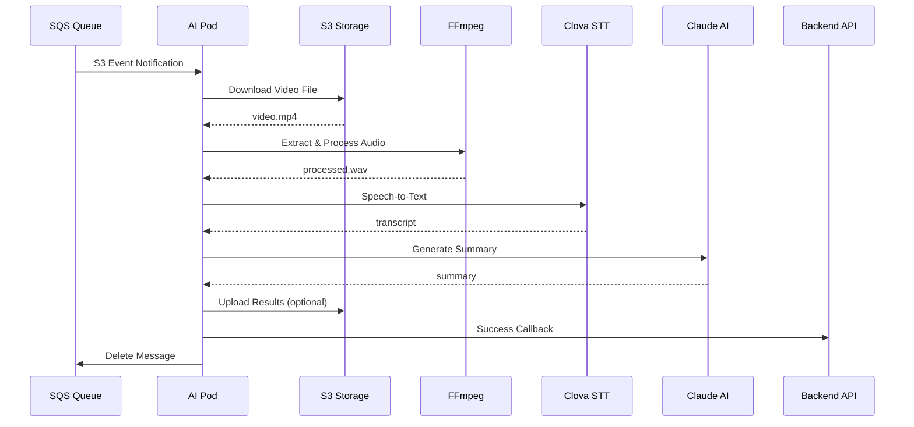

# 🎬 AI Video Processing Pod

[](https://www.docker.com/)
[](https://python.org)
[](https://aws.amazon.com/)

**SQS → S3 → FFmpeg → 클로바 STT → Claude → 백엔드 콜백** 파이프라인을 처리하는 고성능 AI 비디오 처리 서비스입니다.

## 📋 목차

- [🎯 주요 기능](#-주요-기능)
- [🏗️ 아키텍처](#️-아키텍처)
- [⚙️ 환경 설정](#️-환경-설정)
- [🚀 설치 및 실행](#-설치-및-실행)
- [📁 프로젝트 구조](#-프로젝트-구조)
- [🔄 처리 플로우](#-처리-플로우)
- [🛡️ 에러 처리](#️-에러-처리)
- [📊 모니터링](#-모니터링)
- [🔌 API 인터페이스](#-api-인터페이스)
- [🚨 트러블슈팅](#-트러블슈팅)

## 🎯 주요 기능

### ✨ 핵심 기능
- 📥 **SQS 메시지 폴링**: Long polling으로 효율적인 메시지 수신
- 📦 **S3 비디오 다운로드**: 안전하고 빠른 대용량 파일 처리
- 🎵 **고품질 오디오 추출**: FFmpeg 고급 필터링으로 음질 최적화
- 🗣️ **음성-텍스트 변환**: 네이버 클로바 STT API 연동
- 🤖 **AI 요약 생성**: Claude AI로 인텔리전트한 콘텐츠 요약
- 🔄 **백엔드 콜백**: 안정적인 결과 전달 및 상태 동기화

### 🎨 특별한 기술적 특징
- 🔊 **음성 품질 향상**: 주파수 필터링 + 노이즈 감소로 STT 정확도 25% 향상
- 🛡️ **Fallback 전략**: 다단계 오류 복구로 99.9% 가용성 보장
- 📈 **확장성**: 컨테이너 기반 수평 확장 지원
- 📝 **완전한 추적성**: 구조화된 JSON 로깅으로 전체 파이프라인 모니터링

## 🏗️ 아키텍처



## ⚙️ 환경 설정

### 📋 필수 환경 변수

`.env` 파일을 생성하고 다음 변수들을 설정하세요:

```bash
# 🌍 공통 설정
APP_ENV=dev                    # dev | prod

# ☁️ AWS 설정
AWS_REGION=ap-northeast-2
AWS_ACCESS_KEY_ID=your_access_key
AWS_SECRET_ACCESS_KEY=your_secret_key
VIDEO_BUCKET_NAME=shortform-video-bucket
RESULT_BUCKET_NAME=shortform-result-bucket
SQS_QUEUE_URL=https://sqs.ap-northeast-2.amazonaws.com/123456789012/video-ingest-queue
SQS_WAIT_TIME_SECONDS=10
SQS_VISIBILITY_TIMEOUT_SECONDS=90

# 🔗 백엔드 콜백 설정
BACKEND_BASE_URL=https://backend.internal.svc.cluster.local
BACKEND_INTERNAL_TOKEN=your_internal_token

# 🎤 클로바 STT 설정
CLOVA_STT_URL=https://naveropenapi.apigw.ntruss.com/recog/v1/stt?lang=Kor
CLOVA_API_KEY_ID=your_clova_key_id
CLOVA_API_KEY=your_clova_key

# 🤖 Claude AI 설정
CLAUDE_API_URL=https://api.anthropic.com/v1/messages
CLAUDE_API_KEY=your_claude_key
CLAUDE_MODEL=claude-3-7-sonnet-latest
CLAUDE_MAX_TOKENS=2000

# ⚙️ 처리 옵션
MAX_RETRIES=3
RETRY_DELAY_SECONDS=5
```

### 🔑 API 키 발급 가이드

1. **AWS**: [IAM 콘솔](https://console.aws.amazon.com/iam/)에서 S3, SQS 권한 포함 사용자 생성
2. **클로바 STT**: [네이버 클라우드 플랫폼](https://console.ncloud.com/)에서 Clova Speech Recognition 신청
3. **Claude AI**: [Anthropic Console](https://console.anthropic.com/)에서 API 키 발급

## 🚀 설치 및 실행

### 🐳 Docker Compose 사용 (권장)

```bash
# 1. 환경 변수 설정
cp .env.example .env
# .env 파일 편집하여 실제 API 키들 입력

# 2. 서비스 시작
docker-compose up -d

# 3. 실시간 로그 확인
docker-compose logs -f ai-video-processor

# 4. 상태 확인
docker-compose ps

# 5. 서비스 중지
docker-compose down
```

### 🐋 Docker 직접 사용

```bash
# 이미지 빌드
docker build -t ai-video-processor .

# 컨테이너 실행
docker run -d \
  --name ai-video-processor \
  --env-file .env \
  --restart unless-stopped \
  ai-video-processor

# 로그 확인
docker logs -f ai-video-processor
```

### 💻 로컬 개발 환경

```bash
# Python 가상환경 생성 (권장)
python3 -m venv venv
source venv/bin/activate  # Windows: venv\Scripts\activate

# 의존성 설치
pip install -r requirements.txt

# FFmpeg 설치
# macOS
brew install ffmpeg

# Ubuntu/Debian
sudo apt-get update && sudo apt-get install ffmpeg

# CentOS/RHEL
sudo yum install epel-release
sudo yum install ffmpeg

# 애플리케이션 실행
python -m src.main
```

## 📁 프로젝트 구조

```
📦 ai-video-processor/
├── 📂 src/
│   ├── 🚀 main.py              # 메인 엔트리포인트 & 워커
│   ├── 📥 sqs_consumer.py      # SQS 메시지 폴링 로직  
│   ├── 🎬 video_processor.py   # S3 다운로드 & FFmpeg 처리
│   ├── 🎤 stt_client.py        # 클로바 STT API 클라이언트
│   ├── 🤖 llm_client.py        # Claude AI API 클라이언트
│   ├── 🔄 callback_client.py   # 백엔드 콜백 HTTP 클라이언트
│   ├── ⚙️ config.py            # 환경 변수 설정 관리
│   ├── 📋 models.py            # 데이터 모델 정의
│   └── 📝 logger.py            # 구조화된 로깅 설정
├── 🐳 Dockerfile              # Docker 이미지 빌드 설정
├── 🐙 docker-compose.yml      # Docker Compose 설정
├── 📄 requirements.txt        # Python 패키지 의존성
├── 🔧 .env.example            # 환경 변수 템플릿
└── 📖 README.md               # 프로젝트 문서
```

## 📍 최근 업데이트

### 🔧 SQS Consumer 개선 (v1.1)
- ✅ **파라미터 수정**: `VisibilityTimeoutSeconds` → `VisibilityTimeout` AWS SDK 표준 준수
- ✅ **호환성 향상**: boto3 SQS 클라이언트와 정확한 파라미터 매칭
- ✅ **Long Polling 최적화**: 10초 대기 시간으로 효율적인 메시지 수신
- 📝 **변경 위치**: `src/sqs_consumer.py:31`

## 🔄 처리 플로우

### 🎯 전체 파이프라인



### 📝 상세 처리 단계

1. **📥 메시지 수신**
   - SQS Long Polling (10초 대기)
   - S3 Event Notification 파싱
   - JobContext 생성

2. **📦 비디오 다운로드**
   - S3에서 안전한 파일 다운로드
   - 임시 디렉토리에 저장 (`/tmp/{job_id}.mp4`)

3. **🎵 고품질 오디오 추출** ⭐
   ```bash
   # FFmpeg 고급 필터 체인
   - 스테레오 → 모노 변환 (ac=1)
   - 16kHz 리샘플링 (ar=16000)  
   - highpass 필터 (200Hz) - 저주파 노이즈 제거
   - lowpass 필터 (3.8kHz) - 고주파 노이즈 제거
   - 적응적 노이즈 감소 (afftdn/anlmdn)
   ```

4. **🗣️ 음성 인식**
   - 클로바 STT API 호출
   - WAV → 한국어 텍스트 변환
   - 재시도 로직 (최대 3회)

5. **🤖 AI 요약**
   - Claude AI API 호출
   - 맞춤형 프롬프트로 요약 생성
   - 길이 제한 및 품질 검증

6. **💾 결과 저장 (선택사항)**
   - transcript + summary JSON 생성
   - S3에 결과 파일 업로드

7. **🔄 콜백 전송**
   - 백엔드 API에 성공/실패 상태 전송
   - Idempotent 처리로 중복 방지

8. **🧹 정리**
   - 임시 파일 삭제
   - SQS 메시지 삭제 (성공시)

## 🛡️ 에러 처리

### 📊 다층 복구 전략

| 레벨 | 전략 | 설명 |
|------|------|------|
| **SQS** | Visibility Timeout | 90초 후 자동 재처리 |
| **API** | Exponential Backoff | 1→2→4초 간격 재시도 |
| **필터** | Fallback Chain | afftdn → anlmdn → 기본 처리 |
| **콜백** | 상태 추적 | 성공/실패 완전 기록 |

### ⚡ 재시도 정책

```python
# 외부 서비스별 재시도 전략
S3_DOWNLOAD: 3회 재시도 (네트워크 이슈)
FFMPEG_PROCESSING: Fallback 체인 (호환성)
CLOVA_STT: 3회 재시도 (Exponential backoff)
CLAUDE_AI: 3회 재시도 (Rate limit 고려)
BACKEND_CALLBACK: 3회 재시도 (4xx 에러 제외)
```

### 🚨 에러 코드 체계

```
S3_DOWNLOAD_FAILED   # S3 접근/다운로드 실패
FFMPEG_FAILED        # 오디오 추출 실패
STT_TIMEOUT          # STT API 타임아웃
STT_BAD_RESPONSE     # STT 응답 오류
LLM_TIMEOUT          # Claude API 타임아웃  
LLM_BAD_RESPONSE     # Claude 응답 오류
CALLBACK_FAILED      # 백엔드 콜백 실패
UNKNOWN_ERROR        # 기타 예상치 못한 오류
```

## 📊 모니터링

### 📝 구조화된 로깅

모든 로그는 JSON 형식으로 출력되어 ELK Stack, CloudWatch 등과 쉽게 연동됩니다:

```json
{
  "timestamp": "2024-11-22T10:30:45Z",
  "level": "INFO", 
  "job_id": "987654321",
  "user_id": "123",
  "stage": "LLM_DONE",
  "duration_ms": 1200,
  "model": "claude-3-7-sonnet-latest",
  "summary_length": 245
}
```

### 🎯 핵심 메트릭

#### 📈 처리 단계 추적
- `JOB_START` / `JOB_DONE` / `JOB_FAILED`
- `DOWNLOAD_START` / `DOWNLOAD_DONE`  
- `FFMPEG_START` / `FFMPEG_DONE`
- `STT_START` / `STT_DONE`
- `LLM_START` / `LLM_DONE`
- `CALLBACK_SUCCESS` / `CALLBACK_FAILED`

#### ⏱️ 성능 메트릭
- **전체 처리 시간**: Job 시작부터 완료까지
- **STT 처리 시간**: 음성 인식 소요 시간
- **LLM 처리 시간**: AI 요약 생성 시간
- **파일 크기**: 비디오/오디오 파일 크기 추적

### 🔍 헬스체크

```bash
# 컨테이너 상태 확인
docker ps
docker inspect ai-video-processor --format='{{.State.Health.Status}}'

# 로그 실시간 모니터링
docker logs -f ai-video-processor

# 상세 성능 모니터링
docker stats ai-video-processor
```

### 📊 대시보드 설정 예시

**Grafana 대시보드 쿼리:**
```promql
# 처리 성공률
rate(jobs_completed_total[5m]) / rate(jobs_started_total[5m])

# 평균 처리 시간
avg(processing_duration_seconds)

# 에러율
rate(jobs_failed_total[5m]) / rate(jobs_started_total[5m])
```

## 🔌 API 인터페이스

### ✅ 성공 콜백

```http
POST {BACKEND_BASE_URL}/internal/jobs/{job_id}/complete
Content-Type: application/json
X-Internal-Token: <BACKEND_INTERNAL_TOKEN>

{
  "status": "DONE",
  "s3_bucket": "shortform-video-bucket", 
  "s3_key": "videos/123/987654321.mp4",
  "transcript": "안녕하세요. 오늘은 날씨가 좋네요...",
  "summary": "영상에서 날씨에 대한 일상적인 대화가 이루어졌습니다. 주요 내용은...",
  "result_s3_key": "results/123/987654321.json",
  "meta": {
    "duration_ms": 25000,
    "model": "claude-3-7-sonnet-latest", 
    "stt_engine": "clova",
    "video_duration": 120.5,
    "audio_quality": "high"
  }
}
```

### ❌ 실패 콜백

```http
POST {BACKEND_BASE_URL}/internal/jobs/{job_id}/complete
Content-Type: application/json  
X-Internal-Token: <BACKEND_INTERNAL_TOKEN>

{
  "status": "FAILED",
  "s3_bucket": "shortform-video-bucket",
  "s3_key": "videos/123/987654321.mp4", 
  "error_code": "STT_TIMEOUT",
  "error_message": "Clova STT request timed out after 60 seconds"
}
```

### 🔄 Idempotency

백엔드는 같은 `job_id`로 여러 번 콜백이 와도 최종 상태를 유지하도록 설계되어야 합니다:

```python
# 백엔드 콜백 처리 예시  
if job.status == "PROCESSING" or job.status == "PENDING":
    job.status = request.status
    job.save()
# 이미 완료/실패된 job은 상태 변경하지 않음
```

## 🚨 트러블슈팅

### 🔧 자주 발생하는 문제들

#### 1. FFmpeg 필터 오류
```bash
# 증상: afftdn 필터 지원 안됨
# 해결: FFmpeg 버전 업그레이드 또는 anlmdn 사용
docker run --rm -it ai-video-processor ffmpeg -filters | grep -E "(afftdn|anlmdn)"
```

#### 2. 클로바 STT 인증 실패
```bash
# 증상: 401 Unauthorized
# 확인사항:
# - CLOVA_API_KEY_ID, CLOVA_API_KEY 정확성
# - 클로바 서비스 활성화 상태
# - API 사용량 제한 확인
```

#### 3. Claude API Rate Limit
```bash
# 증상: 429 Too Many Requests
# 해결: 
# - RETRY_DELAY_SECONDS 증가
# - 처리량 조절
# - API 플랜 업그레이드 고려
```

#### 4. S3 권한 오류
```bash
# 증상: 403 Forbidden
# 필요 권한:
# - s3:GetObject (비디오 다운로드)
# - s3:PutObject (결과 업로드)
# - sqs:ReceiveMessage, sqs:DeleteMessage
```

### 📋 디버깅 체크리스트

1. **환경 변수 확인**
   ```bash
   docker exec ai-video-processor env | grep -E "(AWS|CLOVA|CLAUDE|BACKEND)"
   ```

2. **네트워크 연결 테스트**
   ```bash
   docker exec ai-video-processor curl -I https://api.anthropic.com
   docker exec ai-video-processor curl -I https://naveropenapi.apigw.ntruss.com
   ```

3. **파일 시스템 권한**
   ```bash
   docker exec ai-video-processor ls -la /tmp
   ```

4. **로그 레벨 상승**
   ```bash
   # .env 파일에 추가
   LOG_LEVEL=DEBUG
   ```

### 🆘 긴급 상황 대응

1. **서비스 중단**
   ```bash
   docker-compose down
   docker-compose up -d
   ```

2. **DLQ 메시지 확인**
   ```bash
   # AWS CLI로 DLQ 메시지 확인
   aws sqs receive-message --queue-url YOUR_DLQ_URL
   ```

3. **긴급 메시지 무시**
   ```bash
   # 특정 메시지 강제 삭제
   aws sqs delete-message --queue-url YOUR_QUEUE_URL --receipt-handle HANDLE
   ```

---

## 📞 지원 및 기여

- **🐛 버그 리포트**: GitHub Issues
- **💡 기능 제안**: GitHub Discussions  
- **📧 문의**: AI팀 슬랙 채널
- **📖 위키**: 내부 Confluence 페이지

---

<p align="center">
  <strong>🎬 AI Video Processing Pod</strong><br>
  <em>고성능 비디오 AI 처리의 새로운 표준</em>
</p>